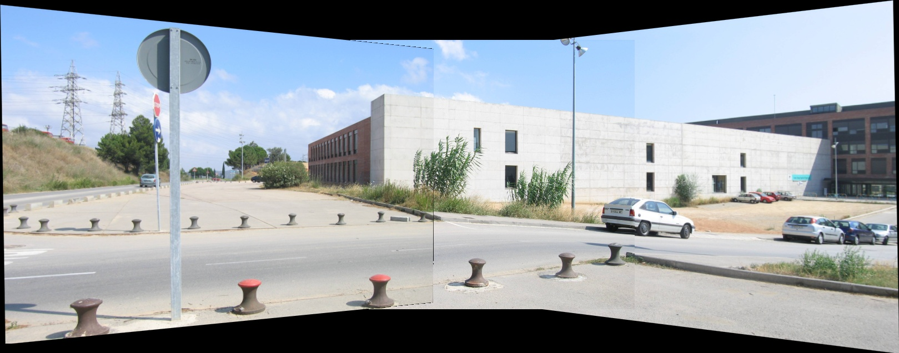

# Panoramic mosaic generation :camera: :sunrise_over_mountains:
This is a very simple project for generating a panoramic mosaic from 3 contiguous images.

## Usage :memo:
Inside this repository you will find the **./ee** directory. This is the location for the sample 
images for executing this project. 

For the correct behaviour of the program **./ee** must have only 3 images. Those images will show up in 
order for a manual input where the user will pick the points related between one image and its next 
(emulating the RANSAC algorithm). 

The program will use those points for the calculation of the **homography matrix**  using the **DLT algorithm**.

To execute the project just run the **panoramic-mosaics.py** file with a Python 3 version.
